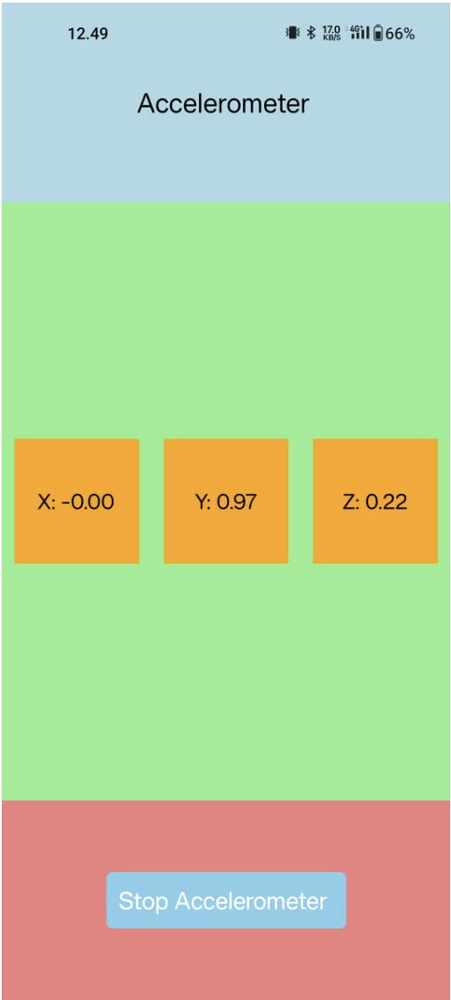

# Accelerometer App

## Overview
This project is a React Native application utilizing the **Expo Sensors** library to interact with the device's accelerometer. The app allows users to start and stop accelerometer data collection and displays the X, Y, and Z axis readings in real-time.


---

## Features

### 1. Real-Time Accelerometer Data
- Displays the current readings of the accelerometer along the X, Y, and Z axes.
- The data updates in real-time when the accelerometer is active.

### 2. Start/Stop Functionality
- Users can toggle the accelerometer on or off using a button.
- The state of the accelerometer is visually indicated by the button text.

### 3. Clean and Intuitive UI
- A simple layout with distinct sections for the header, content, and footer.
- Readings are displayed in individual boxes with clear labels.

---

## Code Explanation

### Functional Components and Hooks
- The app uses React Native functional components and the **useState** and **useEffect** hooks for state management and lifecycle handling.

#### Key States:
1. **data**: Stores the accelerometer readings (X, Y, Z).
2. **isAccelerometerActive**: Boolean flag to track if the accelerometer is active.

#### Accelerometer Management:
- The `Accelerometer.addListener` method is used to start listening for accelerometer data when the sensor is active.
- The listener is removed during cleanup to prevent memory leaks:
```javascript
return () => {
  if (subscription) {
    subscription.remove();
  }
};
```

---

## User Interface

### Components Used
1. **View**: For layout and container grouping.
2. **Text**: For displaying static and dynamic text.
3. **TouchableOpacity**: For creating a tappable button.

### Styling
- The app uses a **StyleSheet** for consistent styling across components.

#### Key Styles:
- **Header**: Displays the title with a light blue background.
- **Content**: A flex container with green background and boxes for accelerometer data.
- **Footer**: Contains the button to toggle accelerometer state.

---

Feel free to extend this app with additional features, such as:
- Logging accelerometer data to analyze motion.
- Visualizing accelerometer data in graphs or animations.
